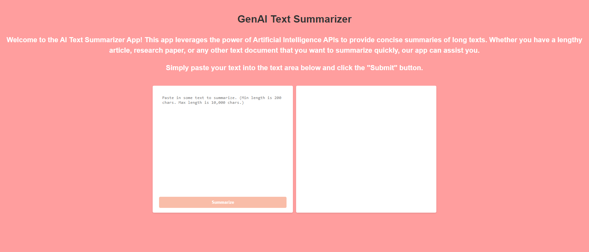
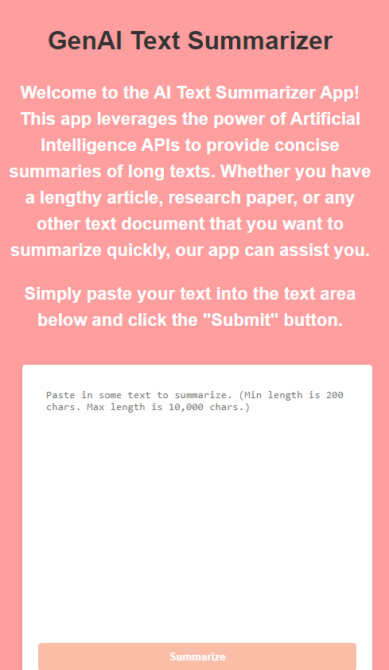

# AI-Text-Summarizer

## Wokring Application
#### Desktop Version
  

#### Mobile Version


## How to run locally?
1. Clone the repo
2. Open this folder in the code editor of your choice.
3. Install all the dependencies by running; 
```
npm install
```
4. Run the application
```
node index
```
You should see *Server running at http://localhost:3000/* as outpout

## Technologies Used

1. Node
2. HTML,CSS, JS
3. Hugging Face Inference API
4. Postman


#### Feel free to drop any suggestions and try it out yourself.